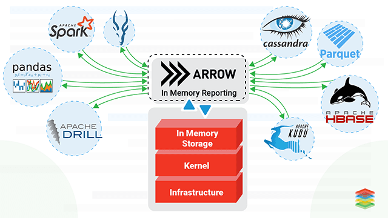
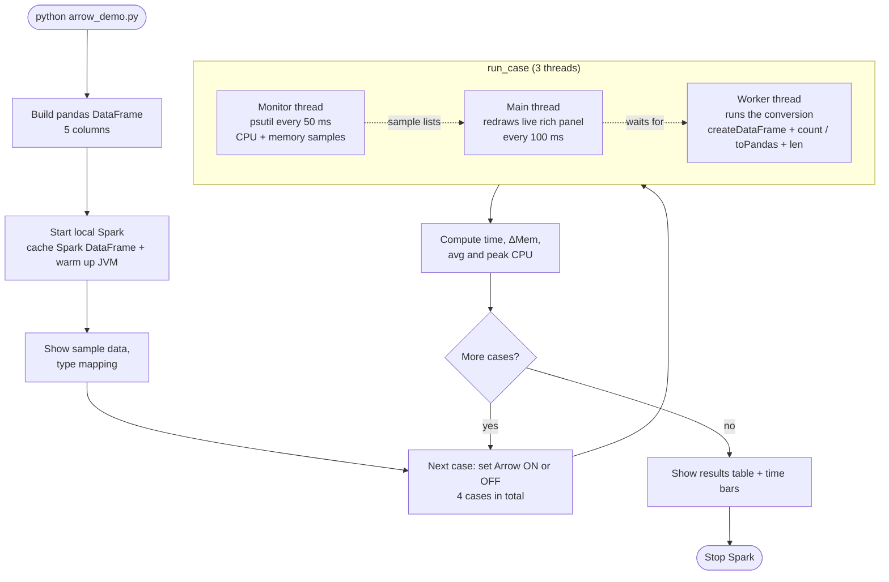
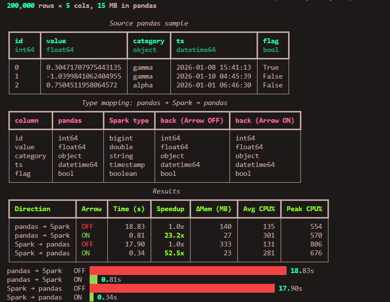

# PySpark ⇄ pandas with Apache Arrow: ON vs OFF

A small script that **measures and visualizes** what happens when you move data between PySpark and pandas, with and without Apache Arrow. It reports time, CPU and memory for each case, and uses [`rich`](https://github.com/Textualize/rich) to show it all live in the terminal.

---

## 1. Purpose

A very common PySpark workflow is: process the big data in Spark, then call `toPandas()` to plot or analyze a small result with pandas / matplotlib. That conversion can be surprisingly slow and memory-hungry.

This demo answers three questions with real numbers:

- How much faster is the conversion with Arrow enabled?
- How much memory and CPU does each mode use?
- How does the data actually travel between the two systems, and does it change on the way?

---

## 2. Apache Arrow in a nutshell


**Apache Arrow** is a language-independent, **columnar in-memory data format**. It defines how a table is laid out in memory so that different systems (Spark, pandas, R, Rust, ...) can exchange data without each one converting it to its own format.

### Why it matters for PySpark ⇄ pandas

Spark runs in the **JVM** and pandas runs in **Python**, so data has to cross a process boundary. There are two ways to do it:

| | Arrow OFF (default in Spark 3.x) | Arrow ON |
|---|---|---|
| **Unit of transfer** | One row at a time | Whole columns, in batches |
| **Serialization** | Python pickle per row | Arrow's binary columnar format |
| **Memory** | Many small Python objects | Large contiguous buffers |

```
Arrow OFF   pandas ──row──row──row──row──▶ pickle ──▶ JVM rebuilds each Row
Arrow ON    pandas ══ column batch ══════▶ Arrow   ══▶ JVM ColumnarBatch
```

> **Note:** Arrow does not make the data "shared memory" between Spark and Python. The data still crosses a process boundary. The gain comes from sending columns in batches instead of pickling row by row.

### Turning it on

```python
spark.conf.set("spark.sql.execution.arrow.pyspark.enabled", "true")
```

After that, `spark.createDataFrame(pandas_df)` and `spark_df.toPandas()` use Arrow automatically.

> `toPandas()` still collects **all** rows onto the driver. Filter, aggregate or sample in Spark first.

---

## 3. How the script works

### Overview

For each combination of **direction** and **Arrow setting**, the script runs the conversion while a monitor records resource usage:

```
pandas → Spark   Arrow OFF
pandas → Spark   Arrow ON
Spark → pandas   Arrow OFF
Spark → pandas   Arrow ON
```

The four cases run **one after another** (never in parallel), so they don't compete for CPU and memory.

### Setup

1. Build a pandas DataFrame with 5 columns of different types: `int64`, `float64`, `str`, `datetime64`, `bool`.
2. Start a local Spark session and create a cached Spark DataFrame from it. This also warms up the JVM, so start-up cost isn't charged to the first case.
3. Turn Arrow's silent fallback **off** (`spark.sql.execution.arrow.pyspark.fallback.enabled=false`). If Arrow can't handle something, the script fails loudly instead of quietly using the slow path.

### The three threads

Each case uses three threads, driven by `run_case()`:

| Thread | Job |
|---|---|
| **Worker** | Runs the actual conversion (`createDataFrame(...).count()` or `toPandas()`) |
| **Monitor** | Every 50 ms, samples CPU and memory with `psutil` and appends them to lists |
| **Main** | Every 100 ms, redraws the live `rich` panel and waits for the worker to finish |

### The monitor

`Monitor` is a context manager. Entering the `with` block starts its thread; leaving it sets a `threading.Event` that tells the thread to stop.

- It measures the **whole process tree**: the Python process plus its children. Spark runs inside a separate `java` process, so measuring Python alone would miss most of the work.
- It does **not** know which thread caused which cost. The numbers are attributed to the conversion because it is the only heavy work running during the monitoring window, and memory is reported as the growth over a baseline taken just before the run.
- CPU is a percentage of **one core**, so it can exceed 100% when several cores are busy.

### What `rich` shows

| Display | Purpose |
|---|---|
| **Table (sample)** | The first rows of the source pandas data and their dtypes |
| **Table (type mapping)** | `pandas dtype → Spark type → pandas dtype`, measured for both modes; any dtype that differs is highlighted |
| **Live panel** | CPU and memory sparklines plus elapsed time, updating while each case runs |
| **Results table + bars** | Time, speedup, memory and CPU for all four cases |

The live panel uses `rich.live.Live`, which repaints the same terminal region several times a second. It is erased when the case ends (`transient=True`), and only the final tables remain.

### The metrics

| Column | Meaning |
|---|---|
| **Time (s)** | Wall-clock time of the conversion |
| **Speedup** | Time with Arrow OFF ÷ time with Arrow ON |
| **ΔMem (MB)** | Peak memory (Python + JVM) minus the memory used just before the case started |
| **Avg CPU %** | Average of the CPU samples (100% = one full core) |
| **Peak CPU %** | Highest CPU sample |

---

## 4. Results

Example run with `python arrow_demo.py` (200,000 rows × 5 columns, about 15 MB in pandas), on a local machine:



What the numbers show:

- **Time:** Arrow is more than 20x faster in both directions, even on a small 7 MB table.
- **Memory:** the Arrow-OFF has higher usage of memory more times than Arrow-ON.
- **CPU:** the average CPU is about the same in both modes. Arrow is not using more cores. It finishes sooner because it does less work per value.


> Your numbers will differ with hardware, row count, column types and Spark/pandas versions. Run the script yourself and compare. The gap usually grows with more rows.

---

## 5. Run it

### Requirements

- Python (.python-version)
- Java (JDK 17) available on your `PATH`, which Spark needs
- Packages:

_*We use uv you can use pip_

```bash
uv init
uv venv # then activate it
uv add pyspark pandas pyarrow rich psutil numpy
```
**OR**
```bash
git clone https://github.com/youssefhk-sw/arrow-demo.git
cd arrow-demo
uv sync
```

### Usage

```bash
# Activate venv
source .venv/bin/activate      # Linux/macOS
.venv\Scripts\activate         # Windows
```

```bash
python arrow_demo.py                 # 200,000 rows (default)
python arrow_demo.py --rows 1000000
```

If PySpark prints warnings about your pandas version (for example with pandas ≥ 3.0), the script suppresses them. Use an older pandas if you hit real incompatibilities.

---

## 6. Limitations

- **Timing resolution:** the elapsed time is taken by the main thread, which checks every 100 ms. Each time can be up to about 0.1 s too high, which matters most for the fast Arrow runs.
- **Overhead included:** the numbers include the small cost of the monitor thread and the `rich` display. It is the same in all four cases, so the comparison stays fair, but absolute numbers are slightly inflated.
- **Local mode only:** Spark runs as a local JVM on one machine. On a cluster, `toPandas()` also involves network transfer and the driver collecting data from executors.
- **Single run per case:** no repetitions or averaging. For rigorous benchmarks, repeat each case several times and report the median.
- **Simple schema:** no nulls, nested types, or decimals. Arrow handles some of these differently.
